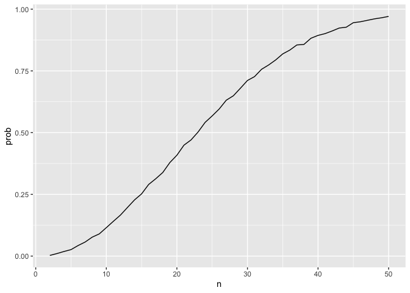
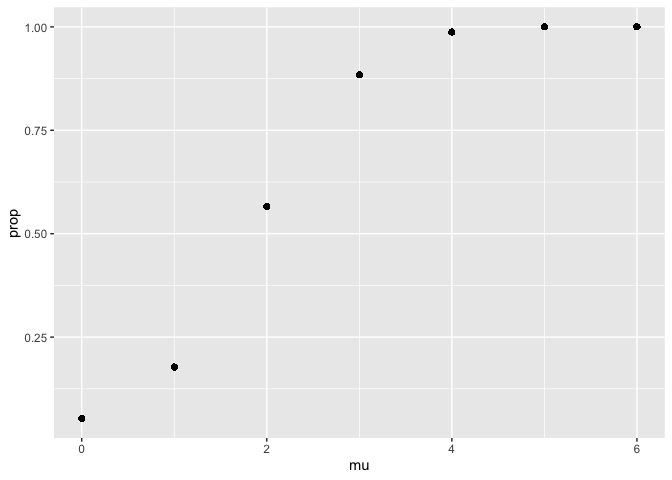
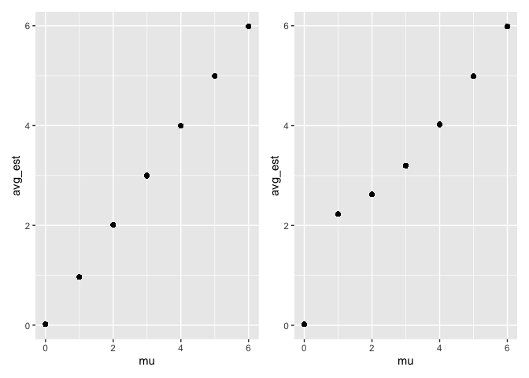
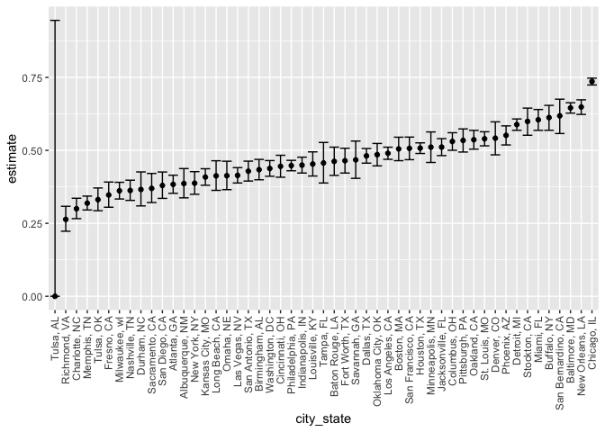

p8105_hw5_ml5222
================
Miriam Lachs
2024-11-10

## Problem 1

``` r
bday_sim= function(n)
{
  bdays=sample(1:365,size = n,replace = TRUE)

  duplicate=length(unique(bdays))<n
  
  return(duplicate)
}

bday_sim(10)
```

    ## [1] TRUE

run this alot

``` r
sim_res=
  expand_grid(
    n= 2:50,
    iter=1:10000
  ) %>% 
  mutate(res=map_lgl(n,bday_sim)) %>% 
  group_by(n) %>% 
  summarise(prob=mean(res))
sim_res %>%
  ggplot(aes(x=n,y=prob))+geom_line()
```

<!-- -->

Based on the plot it would take about 22 people for there to be a shared
birthday more then half the time. As the group size gets larger the
probability approches 1.

## Problem 2

``` r
ttest_sim= function(dataset)
{
  df=t.test(dataset) %>% 
    broom::tidy() %>% 
    select(estimate,p.value)
  return(df)
}


sim_res=
  expand_grid(
    mu=0:6,
    iter=1:5000
  ) %>% 
  mutate(
    dataset=map(mu,\(x) rnorm(30,x,5)),
    res=map(dataset,ttest_sim)
  )

sim_res %>% 
  unnest(res) %>% 
  group_by(mu) %>% 
  mutate(prop=mean((p.value<.05))) %>% 
  ggplot(aes(x=mu, y=prop))+geom_point()
```

<!-- -->
Based on these results, the higher the effect size, or in this case the
greater the mean, the higher the power. This meakes sense because the
difference between the null and the true mean is larger.

``` r
plot_1=sim_res %>% 
  unnest(res) %>% 
  group_by(mu) %>% 
  mutate(avg_est=mean((estimate))) %>% 
  ggplot(aes(x=mu, y=avg_est))+geom_point()

plot_2=sim_res %>% 
  unnest(res) %>% 
  filter(p.value<.05) %>% 
  group_by(mu) %>% 
  mutate(avg_est=mean((estimate))) %>% 
  ggplot(aes(x=mu, y=avg_est))+geom_point()


plot_1+plot_2
```

<!-- --> No
it seems when the null was rejected the avg_est tended to be higher then
the true mu. This is likely because the more extrem the effect size was
more likly to reject the null and there for for the smaller values like
1 there were some time where we failed to reject the null even though
the true mean was greater then 0.

## Problem 3

``` r
homicide_df= read_csv('homicide-data.csv')
```

    ## Rows: 52179 Columns: 12
    ## ── Column specification ────────────────────────────────────────────────────────
    ## Delimiter: ","
    ## chr (9): uid, victim_last, victim_first, victim_race, victim_age, victim_sex...
    ## dbl (3): reported_date, lat, lon
    ## 
    ## ℹ Use `spec()` to retrieve the full column specification for this data.
    ## ℹ Specify the column types or set `show_col_types = FALSE` to quiet this message.

``` r
homicide_df
```

    ## # A tibble: 52,179 × 12
    ##    uid        reported_date victim_last  victim_first victim_race victim_age
    ##    <chr>              <dbl> <chr>        <chr>        <chr>       <chr>     
    ##  1 Alb-000001      20100504 GARCIA       JUAN         Hispanic    78        
    ##  2 Alb-000002      20100216 MONTOYA      CAMERON      Hispanic    17        
    ##  3 Alb-000003      20100601 SATTERFIELD  VIVIANA      White       15        
    ##  4 Alb-000004      20100101 MENDIOLA     CARLOS       Hispanic    32        
    ##  5 Alb-000005      20100102 MULA         VIVIAN       White       72        
    ##  6 Alb-000006      20100126 BOOK         GERALDINE    White       91        
    ##  7 Alb-000007      20100127 MALDONADO    DAVID        Hispanic    52        
    ##  8 Alb-000008      20100127 MALDONADO    CONNIE       Hispanic    52        
    ##  9 Alb-000009      20100130 MARTIN-LEYVA GUSTAVO      White       56        
    ## 10 Alb-000010      20100210 HERRERA      ISRAEL       Hispanic    43        
    ## # ℹ 52,169 more rows
    ## # ℹ 6 more variables: victim_sex <chr>, city <chr>, state <chr>, lat <dbl>,
    ## #   lon <dbl>, disposition <chr>

In the raw homicide data there are 52179 rows and 12 cols.

``` r
homicide_df=homicide_df %>% 
  mutate(city_state= str_c(city,state, sep = ', '),
         unsolved= ifelse(disposition=='Closed without arrest'|disposition=='Open/No arrest',1,0))
```

``` r
unsoved=homicide_df %>% 
  filter(city_state=='Baltimore, MD') %>% 
  pull(unsolved)

proptest=prop.test(sum(unsoved),length(unsoved))

proptest %>% 
  broom::tidy() %>% 
  select(estimate,conf.low, conf.high)
```

    ## # A tibble: 1 × 3
    ##   estimate conf.low conf.high
    ##      <dbl>    <dbl>     <dbl>
    ## 1    0.646    0.628     0.663

``` r
hom_prop_test= function(name){
  unsolved=homicide_df %>% 
  filter(city_state==name) %>% 
  pull(unsolved)


  proptest=prop.test(sum(unsolved),length(unsolved))

  res=proptest %>% 
    broom::tidy() %>% 
    select(estimate,conf.low, conf.high)
  return(res)
}
```

``` r
homicide_df %>% 
  distinct(city_state) %>% 
  mutate(prop_test=  map(city_state,hom_prop_test)) %>% 
  unnest(prop_test) %>% 
  mutate(city_state=fct_reorder(as_factor(city_state),estimate))%>% 
  ggplot(aes(x=city_state,y=estimate))+geom_errorbar(aes(ymin=conf.low,ymax=conf.high))+geom_point()+ theme(axis.text.x = element_text(angle = 90, vjust = 0.5, hjust=1))
```

    ## Warning: There was 1 warning in `mutate()`.
    ## ℹ In argument: `prop_test = map(city_state, hom_prop_test)`.
    ## Caused by warning in `prop.test()`:
    ## ! Chi-squared approximation may be incorrect

<!-- -->
